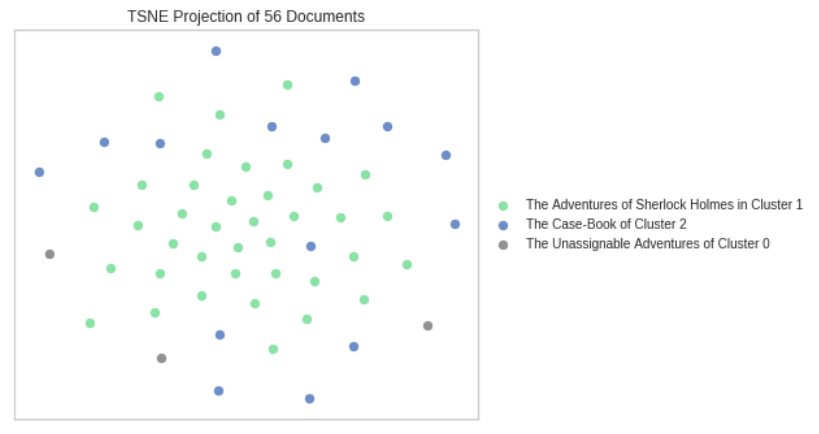

# Results HolmesClustering
According to project goals, outlined in project briefing (`BRIEFING.md`):

* We've found at least the second best assignment of stories to collections (he best is to treat the canon as a whole).

Using NLP and the clustering approach leads to this document-collection assignment with a cluster size of three:

In following table, original and novel assignment to collections is compared:
 
|                                             | Original Collection               | Novel Collection                               |
|---------------------------------------------|-----------------------------------|------------------------------------------------|
| THE ADVENTURE OF THE ABBEY GRANGE           | The_Return_of_Sherlock_Holmes     | The Adventures of Sherlock Holmes in Cluster 1 |
| THE CROOKED MAN                             | The_Memoirs_of_Sherlock_Holmes    | The Adventures of Sherlock Holmes in Cluster 1 |
| THE RESIDENT PATIENT                        | The_Memoirs_of_Sherlock_Holmes    | The Adventures of Sherlock Holmes in Cluster 1 |
| THE ADVENTURE OF THE THREE GABLES           | The_Case-Book_of_Sherlock_Holmes  | The Adventures of Sherlock Holmes in Cluster 1 |
| THE ADVENTURE OF THE BLUE CARBUNCLE         | The_Adventures_of_Sherlock_Holmes | The Adventures of Sherlock Holmes in Cluster 1 |
| THE ADVENTURE OF THE CARDBOARD BOX          | His_Last_Bow                      | The Adventures of Sherlock Holmes in Cluster 1 |
| SILVER BLAZE                                | The_Memoirs_of_Sherlock_Holmes    | The Case-Book of Cluster 2                     |
| THE ADVENTURE OF BLACK PETER                | The_Return_of_Sherlock_Holmes     | The Adventures of Sherlock Holmes in Cluster 1 |
| THE ADVENTURE OF THE DANCING MEN            | The_Return_of_Sherlock_Holmes     | The Case-Book of Cluster 2                     |
| THE ILLUSTRIOUS CLIENT                      | The_Case-Book_of_Sherlock_Holmes  | The Adventures of Sherlock Holmes in Cluster 1 |
| THE ADVENTURE OF THE DYING DETECTIVE        | His_Last_Bow                      | The Adventures of Sherlock Holmes in Cluster 1 |
| THE ADVENTURE OF THE BERYL CORONET          | The_Adventures_of_Sherlock_Holmes | The Adventures of Sherlock Holmes in Cluster 1 |
| THE ADVENTURE OF THE VEILED LODGER          | The_Case-Book_of_Sherlock_Holmes  | The Adventures of Sherlock Holmes in Cluster 1 |
| THE ADVENTURE OF THE LION'S MANE            | The_Case-Book_of_Sherlock_Holmes  | The Adventures of Sherlock Holmes in Cluster 1 |
| THE PROBLEM OF THOR BRIDGE                  | The_Case-Book_of_Sherlock_Holmes  | The Case-Book of Cluster 2                     |
| THE ADVENTURE OF THE MISSING THREE-QUARTER  | The_Return_of_Sherlock_Holmes     | The Adventures of Sherlock Holmes in Cluster 1 |
| THE MUSGRAVE RITUAL                         | The_Memoirs_of_Sherlock_Holmes    | The Adventures of Sherlock Holmes in Cluster 1 |
| THE DISAPPEARANCE OF LADY FRANCES CARFAX    | His_Last_Bow                      | The Adventures of Sherlock Holmes in Cluster 1 |
| THE ADVENTURE OF THE NOBLE BACHELOR         | The_Adventures_of_Sherlock_Holmes | The Adventures of Sherlock Holmes in Cluster 1 |
| THE ADVENTURE OF THE THREE GARRIDEBS        | The_Case-Book_of_Sherlock_Holmes  | The Adventures of Sherlock Holmes in Cluster 1 |
| THE GLORIA SCOTT                            | The_Memoirs_of_Sherlock_Holmes    | The Adventures of Sherlock Holmes in Cluster 1 |
| THE ADVENTURE OF THE NORWOOD BUILDER        | The_Return_of_Sherlock_Holmes     | The Case-Book of Cluster 2                     |
| THE MAN WITH THE TWISTED LIP                | The_Adventures_of_Sherlock_Holmes | The Adventures of Sherlock Holmes in Cluster 1 |
| THE ADVENTURE OF THE SECOND STAIN           | The_Return_of_Sherlock_Holmes     | The Case-Book of Cluster 2                     |
| THE FINAL PROBLEM                           | The_Memoirs_of_Sherlock_Holmes    | The Adventures of Sherlock Holmes in Cluster 1 |
| THE ADVENTURE OF THE SPECKLED BAND          | The_Adventures_of_Sherlock_Holmes | The Unassignable Adventures of Cluster 0       |
| THE ADVENTURE OF THE RED CIRCLE             | His_Last_Bow                      | The Adventures of Sherlock Holmes in Cluster 1 |
| THE BLANCHED SOLDIER                        | The_Case-Book_of_Sherlock_Holmes  | The Adventures of Sherlock Holmes in Cluster 1 |
| THE BOSCOMBE VALLEY MYSTERY                 | The_Adventures_of_Sherlock_Holmes | The Case-Book of Cluster 2                     |
| THE ADVENTURE OF THE SOLITARY CYCLIST       | The_Return_of_Sherlock_Holmes     | The Adventures of Sherlock Holmes in Cluster 1 |
| THE ADVENTURE OF SHOSCOMBE OLD PLACE        | The_Case-Book_of_Sherlock_Holmes  | The Adventures of Sherlock Holmes in Cluster 1 |
| THE ADVENTURE OF THE GOLDEN PINCE-NEZ       | The_Return_of_Sherlock_Holmes     | The Case-Book of Cluster 2                     |
| A SCANDAL IN BOHEMIA                        | The_Adventures_of_Sherlock_Holmes | The Adventures of Sherlock Holmes in Cluster 1 |
| THE ADVENTURE OF THE ENGINEER'S THUMB       | The_Adventures_of_Sherlock_Holmes | The Adventures of Sherlock Holmes in Cluster 1 |
| THE ADVENTURE OF THE SUSSEX VAMPIRE         | The_Case-Book_of_Sherlock_Holmes  | The Adventures of Sherlock Holmes in Cluster 1 |
| THE FIVE ORANGE PIPS                        | The_Adventures_of_Sherlock_Holmes | The Adventures of Sherlock Holmes in Cluster 1 |
| THE STOCK-BROKER'S CLERK                    | The_Memoirs_of_Sherlock_Holmes    | The Adventures of Sherlock Holmes in Cluster 1 |
| THE ADVENTURE OF THE THREE STUDENTS         | The_Return_of_Sherlock_Holmes     | The Case-Book of Cluster 2                     |
| THE NAVAL TREATY                            | The_Memoirs_of_Sherlock_Holmes    | The Case-Book of Cluster 2                     |
| THE ADVENTURE OF THE BRUCE-PARTINGTON PLANS | His_Last_Bow                      | The Case-Book of Cluster 2                     |
| THE ADVENTURE OF THE COPPER BEECHES         | The_Adventures_of_Sherlock_Holmes | The Case-Book of Cluster 2                     |
| THE YELLOW FACE                             | The_Memoirs_of_Sherlock_Holmes    | The Adventures of Sherlock Holmes in Cluster 1 |
| THE ADVENTURE OF THE RETIRED COLOURMAN      | The_Case-Book_of_Sherlock_Holmes  | The Adventures of Sherlock Holmes in Cluster 1 |
| THE ADVENTURE OF WISTERIA LODGE             | His_Last_Bow                      | The Case-Book of Cluster 2                     |
| THE ADVENTURE OF THE MAZARIN STONE          | The_Case-Book_of_Sherlock_Holmes  | The Adventures of Sherlock Holmes in Cluster 1 |
| THE GREEK INTERPRETER                       | The_Memoirs_of_Sherlock_Holmes    | The Adventures of Sherlock Holmes in Cluster 1 |
| THE ADVENTURE OF THE CREEPING MAN           | The_Case-Book_of_Sherlock_Holmes  | The Adventures of Sherlock Holmes in Cluster 1 |
| THE RED-HEADED LEAGUE                       | The_Adventures_of_Sherlock_Holmes | The Case-Book of Cluster 2                     |
| A CASE OF IDENTITY                          | The_Adventures_of_Sherlock_Holmes | The Adventures of Sherlock Holmes in Cluster 1 |
| THE REIGATE SQUIRES                         | The_Memoirs_of_Sherlock_Holmes    | The Case-Book of Cluster 2                     |
| THE ADVENTURE OF THE PRIORY SCHOOL          | The_Return_of_Sherlock_Holmes     | The Unassignable Adventures of Cluster 0       |
| THE ADVENTURE OF THE DEVIL'S FOOT           | His_Last_Bow                      | The Unassignable Adventures of Cluster 0       |
| HIS LAST BOW                                | His_Last_Bow                      | The Adventures of Sherlock Holmes in Cluster 1 |
| THE ADVENTURE OF THE SIX NAPOLEONS          | The_Return_of_Sherlock_Holmes     | The Case-Book of Cluster 2                     |
| THE ADVENTURE OF THE EMPTY HOUSE            | The_Return_of_Sherlock_Holmes     | The Adventures of Sherlock Holmes in Cluster 1 |
| THE ADVENTURE OF CHARLES AUGUSTUS MILVERTON | The_Return_of_Sherlock_Holmes     | The Adventures of Sherlock Holmes in Cluster 1 |

## Reproduce Results
* Change directory to `holmes_clustering/notebook`, run `jupyter notebook` and select notebook `2_Modeling`

## Conclusion
A more rational assignment of Sherlock Holmes stories to collections, than the original one by Sir Arthur Conan Doyle, is possible. And this can be achieved by using NLP and a clustering approach. Nonetheless, the findings suggest that treating the canon as a whole is the best solution after all.
